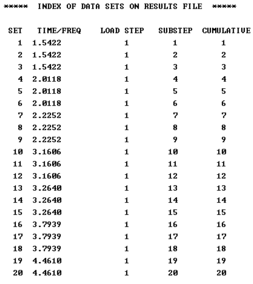
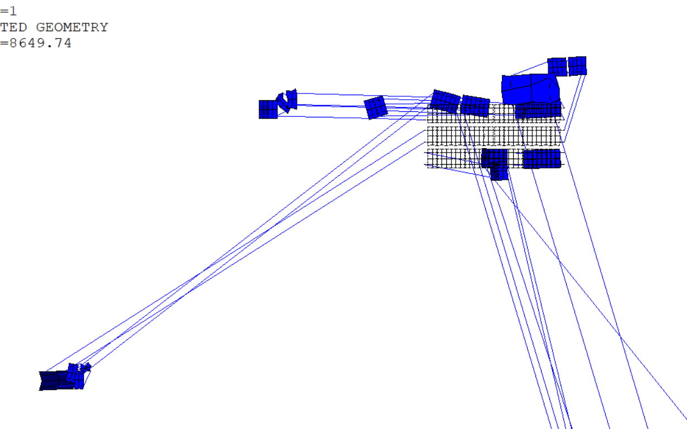
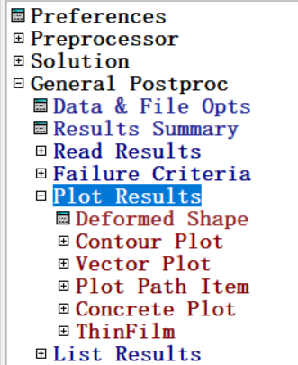

# 风振计算 To Do List

## 1.Extracting Structural Geometry Information

***software: cad, matlab, excel***

* 光伏板角点

  xyz，编号

* 光伏板索

编号包括：风振实验的编号、matlab编号、apdl编号。apdl的编号需要设计，从而更方便后续加荷载、后处理等。

数据格式：x_array (1,Nx); y_array(1,Ny)

* 光伏板和索和立柱坐标分为三部分：

  panelx_all, panely_all：一块板通过$3*5$个点，分成$2*4$ 个矩形，因此一共有$15*42=630$个panelnode点

  cablex_all, cabley_all：索的点和panel重合，不重新定义

  columnnodex, columnnodey：12个立柱点 

  

* 光伏板测压点

  xyz，编号，控制面积

测压计没有满布，部分光伏板没有测压点。风压分析时已进行插值，每块光伏板都有8个虚拟测压点。测压点采用插值后的虚拟测压点

## 2.Build the Model

***software: use matlab to write apdl script***

### Establish Element Type, Real Constant, Material Props

in the file `defineElementTypeConstantMaterial.txt`

* **Element Type**

  Cable: use apdl element type link10

  Panel: use apdl element type shell181

* **Real Constant**

* **Material Props**

```fortran
R,2,191e-6,50/1.94E5      !导线实常数，截面积，初应变，施加535MPa初应力,找型时施加很小弹性模量
R,3,35e-3               !板厚35mm
!**********单元定义***********
PI=3.1415926

ET,1,LINK10      !只受拉,拉索材料          
ET,3,shell181      !光伏板
ET,4,mass21
!Z轴为重力作用轴
DENSOFTIE=7.85e3       !单位:kg/(m^3),即为立柱Q345密度
!材料2-拉索F
DEN_RATIO2=1
MPTEMP,,,,,,,,  
MPTEMP,1,0 
MPDATA,EX,2,,1.95E11           !弹性模量：1.95e11 N/(m^2)，
MPDATA,PRXY,2,,0.3
MPDATA,DENS,2,,DEN_RATIO2*DENSOFTIE     !钢索密度7.864e3,单位：kg/(m^3)
!材料3-光伏板
DEN_RATIO3=0.0387         !光伏板密度与钢材密度之比
MPTEMP,,,,,,,,  
MPTEMP,1,0 
MPDATA,EX,3,,0.72e10     !单位量纲：N/(m^2) 假定
MPDATA,PRXY,3,,0.2
MPDATA,DENS,3,,DEN_RATIO3*DENSOFTIE          !光伏板密度3.0425e2,单位:kg/(m^3)
!************ 截面定义 ***************
!拉索截面定义
SECTYPE,2, LINK,, D0.6, 0        !主拉线,等效面积0.280mm2
SECOFFSET, CENT 
!光伏板截面定义
SECTYPE, 3, SHELL     !光伏板
```

### 3Establish Geometry

**APDL Script FileName:  `geometry.txt`**

**Matlab Writer FileName: `writeNodeElement.m`**

#### **Node**

* loaded data type is array：x_array (1,Nx); y_array(1,Ny)

* 光伏板和索和立柱坐标分为三部分：

  panelx_all, panely_all：一块板通过$3*5$个点，分成$2*4$ 个矩形，因此一共有$15*42=630$个panelnode点

  cablex_all, cabley_all：索的点和panel重合，不重新定义

  columnnodex, columnnodey：12个立柱点 

  Loaded File Name：`cablenodeCoordination.mat`, `columnnodeall.mat`, `panelnodeall.mat`

  

  ```matlab
  % write the column nodes
  arrayX = columnnodex;
  arrayY = columnnodey;
  arrayZ = zeros(1,numel(columnnodey));
  for nodeNumber = 1:numel(columnnodey)
      fprintf(fileID, 'N,%5d,%12.6f,%12.6f,%12.6f\n', nodeNumber,arrayX(nodeNumber),arrayY(nodeNumber),arrayZ(nodeNumber));
  end
  
  % write the panel nodes
  arrayX = panelx_all;
  arrayY = panely_all;
  arrayZ = zeros(1,numel(panely_all));
  for nodeNumber = 1:numel(panely_all)
      fprintf(fileID, 'N,%5d,%12.6f,%12.6f,%12.6f\n', nodeNumber+100,arrayX(nodeNumber),arrayY(nodeNumber),arrayZ(nodeNumber));
  end
  ```

#### Element

Two element type: cable represented by link10 and panel represented by shell181

Details are in ansys helper.

```matlab
% define the element options
fprintf(fileID, "TYPE,1             !单元类型1，杆单元\n");
fprintf(fileID, "MAT,2              !材料类型2\n");
fprintf(fileID, "SECNUM,2           !截面类型2，拉索\n");
fprintf(fileID, "REAL,2             !实常数2\n");

% define the element entity of cable
fprintf(fileID, "!define the element entity of cable\n");
cablenodei = [1, [143:184],3, [143:184]+42*2, 5, [143:184]+42*5, 7, [143:184]+42*7, 9, [143:184]+42*10, 11, [143:184]+42*12];
cablenodej = [[143:184],2, [143:184]+42*2, 4, [143:184]+42*5, 6, [143:184]+42*7, 8, [143:184]+42*10, 10, [143:184]+42*12, 12];
for cableNo = 1: numel(cablenodej)
    fprintf(fileID, "EN,%5d,%5d,%5d\n",cableNo,cablenodei(cableNo),cablenodej(cableNo));
end

% define the element options
fprintf(fileID, "TYPE,3             !单元类型3，壳单元  \n");
fprintf(fileID, "MAT,3              !材料类型1，Q345\n");
fprintf(fileID, "REAL,3             !实常数3\n");
fprintf(fileID, "SECNUM,3           !截面类型3\n");

% define the element entity of panel
%give four node to establish a rectangular, so basicrect1 represent an
%basic rectangular. Than build all rectangular basicrect5.  
basicrect1 = [101,102,144,143]';
basicrect2 = [basicrect1, basicrect1+1];
basicrect3 = [basicrect2, basicrect2+42, basicrect2+42*2, basicrect2+42*3];
basicrect4 = basicrect3;
for i = 1:13
    basicrect4 = [basicrect4, basicrect3+3*i];
end
basicrect5 = [basicrect4, basicrect4+210,basicrect4+210*2];

rect = basicrect5;
for rectNo = 1:size(rect,2)
    fprintf(fileID, "EN,%5d,%5d,%5d,%5d,%5d\n",rectNo+300,rect(1,rectNo), rect(2,rectNo), rect(3,rectNo), rect(4,rectNo));
end
```


## 4.Establish Initial Conditions

*software: in apdl script*

**预应力大变形静力分析：悬索找型**

```fortran
!*************************************!
!               找型        
!*************************************!
*do,i,1,50
/solu
ALLSEL                   !选择全部
ACEL,,,9.8,               !施加重力
NLGEOM,1                 !考虑大变形效应                                                                                    
TIME,1                   !设置载荷步时间
AUTOTS,on                !采用自动时间步长
KBC,0                    !指定载荷步为非阶跃方式
SSTIF,on                 !在非线性分析中，激活应力刚度效应
                 
!outpr,basic,last       !out+print    output windows
!outres,basic,last      !out+results
solve                                                                                                
finish  

!/POST1
!ALLSEL,ALL
!PLNSOL,U,Z

/SOLU
UPCOORD,1,ON
*enddo

!*************************************!
!      write emat file for psolve        
!*************************************!
!大变形有预应力静力分析
/SOLU
ANTYPE,0
NLGEOM,ON !打开大变形效应
PSTRES,ON !打开预应力效应
EMATWRITE,YES !写出emat文件，pslove求解必用
NSUBST,50 !设置荷载步
OUTRES,ALL,ALL !设置结果输出频度
SOLVE
FINISH
```


***Important Note***

```fortran
!      write emat file for psolve        
!*************************************!
!大变形有预应力静力分析
/SOLU
ANTYPE,0
NLGEOM,ON !打开大变形效应
PSTRES,ON !打开预应力效应
EMATWRITE,YES !写出emat文件，pslove求解必用
NSUBST,50 !设置荷载步
OUTRES,ALL,ALL !设置结果输出频度
SOLVE
FINISH
```

* **this part will lead to structure unreasonable displacement even under small load**

* **So, only implement this part before analysis modal, which require psolve**
* ***DO NOT* implement this part before apply load, eg. transient, static analysis etc.**

## 5检查模型是否约束

* 模态分析
* 静力分析

## 6. Applying Loads and Obtaining the Solution

### Establish Constraint

select node set. establish constraint


### Specifying the Analysis Type and Analysis Options

*software: apdl script*

#### Transient Analysis (Mode-Superposition Method)

```fortran
!*********************!
! transient analysis options
!*********************!
/sol
/SOLU
ALLSEL,ALL 
ANTYPE,trans
TRNOPT,MSUP,45,,,,,YES
ACEL,,,9.800
!NLGEOM,ON
AUTOTS, ON
PSTRES,ON ！打开预应力效应
SSTIF,ON !打开应力钢化效应
NSUBST,1
OUTRES,ALL,ALL
MDAMP,    1,    0.050000
MDAMP,    2,    0.050000
...
MDAMP,    45,   0.050000	
save
solve
```

* **ANTYPE,TRANS**

  transient analysis

* **TRNOPT,MSUP,50,,,,,YES**

  ```
  TRNOPT, Method, MAXMODE, --, MINMODE, MCout, TINTOPT, VAout, DMPSFreq, EngCalc
  ```

  Specifies transient analysis options.

  *Parameters:*

  MSUP: Mode-superposition method.

  50: Largest mode number to be used to calculate the response is 50.

  YES: Calculate damping energy and work done by external loads.

* **ACEL,,,9.800**

  ```
  ACEL, ACEL_X, ACEL_Y, ACEL_Z
  ```

  Specifies the linear acceleration of the global Cartesian reference frame for the analysis.

* **FCUM,ADD,,**

  ```
  FCUM, Oper, RFACT, IFACT
  ```

  Specifies that force loads are to be accumulated.

  *Parameters:*

  REPL: Subsequent values replace the previous values (default).

  ADD: Subsequent values are added to the previous values.

  IGNO: Subsequent values are ignored.

* **MDAMP,1,0.02**

  ```
  MDAMP, STLOC, V1, V2, V3, V4, V5, V6
  ```

  Defines the damping ratios as a function of mode.

* **NLGEOM,ON**

  Activates large deflection effects, which is important for accurate nonlinear dynamic analysis.

* **PSTRES,ON** and **SSTIF,ON**: 

  These commands activate prestress effects and include stress-stiffening in the analysis, respectively.

* **AUTOTS, ON**

  Specifies whether to use automatic time stepping or load stepping.

#### Transient Analysis (完全法，有大变形只能用完全法)

```fortran
!*********************!
! transient analysis options
!*********************!
/sol
/SOLU
ALLSEL,ALL 
ANTYPE,trans
TRNOPT,FULL
ACEL,,,-9.800
NLGEOM,ON ! 大变形效应只有在瞬态分析完全法中才能使用
AUTOTS, ON
PSTRES,ON !打开预应力效应
SSTIF,ON !打开应力钢化效应
NSUBST,1
OUTRES,ALL,ALL
save
solve 
```

- `/SOLU`: Enters the solution environment. The `$ALLSEL,ALL` part seems to be a combination of commands and might be incorrectly formatted. The correct command to select all entities is `ALLSEL,ALL` or simply `ALLSEL` for APDL.
- `ANTYPE,trans`: Specifies a transient analysis.
- `TRNOPT,FULL`: full method transient analysis
- `NLGEOM,ON`: Activates large deflection effects, which is important for accurate nonlinear dynamic analysis.
- `PSTRES,ON` and `SSTIF,ON`: These commands activate prestress effects and include stress-stiffening in the analysis, respectively.
- `NSUBST,1`: Sets the number of substeps. This might need adjustment based on the analysis requirements.
- `OUTRES,ALL,ALL`: Specifies that all results should be output for all substeps.

#### Modal Analysis with PreStress

```fortran
/SOLU !模态分析
ANTYPE,MODAL
UPCOORD,1,ON
PSTRES,ON
MODOPT,LANB,20
MXPAND,20
PSOLVE,EIGLANB
FINISH
/SOLU !模态扩展
EXPASS,ON
PSOLVE,EIGEXP
```

* **UPCOORD**, FACTOR, Key
  Modifies the coordinates of the active set of nodes, based on the current displacements.
* **PSOLVE**
  - The `PSOLVE` command is specifically used for solving prestressed analysis steps, particularly useful in subsequent analyses that need to consider prestress effects, such as prestressed modal analysis.
  - Before using `PSOLVE`, a static analysis step to generate the prestress effects is usually performed. Then, `PSOLVE` is used for the subsequent analysis that incorporates these prestress effects.
* 如果要在后处理器查看阵型，则必须使用模态扩展


* **前7阶模态结果**

  因为这里有三个独立的光伏板，所以所有同阶模态会有三个，因此，如果想知道前20阶模态，需要设置求解前60阶，才能得到20个独立的模态。

  

* **查看结果方法**

  ```fortran
  !**************************!
  ! run code after modal analysis
  !**************************!
  /POST1
  SET,LIST !表格形式查看所有固有频率（大变形预应力后的固有频率）
  
  /REPLO  
  SET,LIST,999
  SET,,, ,,, ,10  !选择第10阶模态
  PLDISP,0        !绘制模态变形图
  ```

### Apply Load

#### Write APDL Script by Matlab （Recommand)

##### Example

```matlab
% tanggui's code H:\煤棚抗风动力可靠度分析20200608\ansys有限元计算
%% 本程序用于生成ansys时程计算文件
clc;
clear;
path=cd;
%设置风向角
ww=0:10:350;
freq = 312.5;
time = 90;
N = freq * time;
geometricScale = 250;
windspeedScale = 43.4/11.8;
timeScale = geometricScale / windspeedScale;
protoFreq = freq / timeScale;
dt = 1 / protoFreq;
timeNum = 2800;
t=dt:dt:(timeNum * dt);
inputPath = strcat(['E:\煤棚抗风动力可靠度分析20200608']);

blockNum_roof = 112;
blockNum_gable = 16;
blockNum_total = 240;
blockNum = 128;

fid1_output=fopen(['.\计算文件\timeHistoryComputingFile.txt'],'w');
fid1_forward=fopen('.\forward.txt','r');
Data_forward=fread(fid1_forward);
fwrite(fid1_output,Data_forward);
fclose(fid1_forward);

inputFile = strcat([inputPath,'\区块中心点坐标_中部分开.xlsx']);
loadPoint = xlsread(inputFile,'Sheet4');
for num=1:1
    w=ww(num);
    inputFile=strcat(['.\风荷载时程\windForceTimehistory_',num2str(w),'.mat']);
    load(inputFile);

    for tt = 1:timeNum
        fprintf(fid1_output,'TIME,%12.6f\n',t(tt));
        fprintf(fid1_output,'NSUBST,1,,,1\nKBC,0\n');
        for i=1:112
            fprintf(fid1_output,'F,%d,FY,%12.6f\n',loadPoint(i),windForce(i,tt));
            fprintf(fid1_output,'F,%d,FZ,%12.6f\n',loadPoint(i),windForce(blockNum_roof+i,tt));
        end
        for i=113:128
            fprintf(fid1_output,'F,%d,FX,%12.6f\n',loadPoint(i),windForce(blockNum_roof+i,tt));
        end
        fprintf(fid1_output,'SAVE\nSOLVE\n');
    end
end
fid1_backward=fopen('.\backward.txt','r');
Data_backward=fread(fid1_backward);
fwrite(fid1_output,Data_backward);
fclose(fid1_backward);

fclose(fid1_output);
clear Data_forward Data_backward;
```

**the output of the matlab code looks like:**

An example load step file is shown below:

```fortran
TIME, ...           	! Time at the end of 1st transient load step 
Loads  ...     			! Load values at above time
KBC, ...         		! Stepped or ramped loads
LSWRITE            	! Write load data to load step file
TIME, ...           	! Time at the end of 2nd transient load step 
Loads  ...         	! Load values at above time
KBC, ...           	! Stepped or ramped loads
LSWRITE          		! Write load data to load step file
TIME, ...           	! Time at the end of 3rd transient load step 
Loads  ...         	! Load values at above time
KBC, ...           	! Stepped or ramped loads
LSWRITE            	! Write load data to load step file
Etc.
```

##### Todo

* up mimus down to get net pressure

* get mapping relation between pressure data order and apdl node number

  stored in `pressurenumbermapping.mat`

* define time steps, write each time step's force to apdl script

  use `writeloadfile.m` to write `loadhistory.txt`

  

##### apply surface load on shell181 element

Pressures
	face 1 (I-J-K-L) (bottom, in +N direction),
	face 2 (I-J-K-L) (top, in -N direction),
	face 3 (J-I), face 4 (K-J), face 5 (L-K), face 6 (I-L)


```fortran
!example
*DO,i,1,numTimeSteps,1
    ! Apply the load for the current time step
    SFE, Elem, LKEY, Lab, KVAL, VAL1, VAL2, VAL3, VAL4
    TIME,PressureTime(i)  ! Advance to the time of the load step
    SOLVE  ! Solve for the current time step
*ENDDO
```


#### Use APDL Loop

```fortran
NN=10000 !单点数据长度
*DIM,W150,,63,NN !创建节点风荷载存储文件,default type is ARRAY, dimension 63*n[*1]
*VREAD,WF,WF150.TXT,,JIK,NN,63 !先读入行，后读入列
(10000F1.8)!读入格式，每行10000个数据，1个字节，数点后8位
 

*DO,I,1,NN
 TIME,I
 *DO,II,1,63 
  FDELE,ALL,ALL   
  F,II+100,FZ,WF(II,I)
  PSOLVE
 *ENDDO
*ENDDO
FINISH
                 
  !动画查看变形结果
!/POST1
```

##### **Reading Wind Load Time History Data:**

* **Create,dataread,macro**

**Macros are a sequence of Mechanical APDL commands stored in a file.** Macros should not have the same name as an existing Mechanical APDL command, or start with the first four characters of a Mechanical APDL command, because Mechanical APDL executes the internal command instead of the macro. 

* **\*DIM,W150,,63,NN** 

`*DIM, Par, Type, IMAX, JMAX, KMAX, Var1, Var2, Var3, CSYSID `
Defines an array parameter and its dimensions.

创建节点风荷载存储文件`W150`,default type is ARRAY, dimension $63*NN[*1]$

* ***VREAD,WF,WF150.TXT,,JIK,NN,63**

> You can fill an array from a data file via the *VREAD command. The command reads information from an ASCII data file and begins writing it into the array, starting with the index location that you specify. You can control the format of the information read from the file through data descriptors. The data descriptors must be enclosed in parenthesis and placed on the line following the *VREAD command. See Vector Operations for more information about data descriptors. The data descriptors control the number of fields to be read from each record, the width of the data fields, and the position of the decimal point in the field.

```
*VREAD, ParR, Fname, Ext, --, Label, n1, n2, n3, NSKIP
```

Reads data and produces an array parameter vector or matrix.

Reads the wind load data from a text file named `WF150.TXT` into the array.

The format `(10000F1.8)` specifies that each line of the file contains 10,000 floating-point numbers with one digit before the decimal and eight digits after the decimal.


##### **Applying Loads and Solving**

The nested `*DO` loops iterate over each time step (`I`) and each node (`II`). Within each iteration, the script:

- Deletes all previously applied loads with `FDELE,ALL,ALL`.
- Applies a force in the Z direction (`FZ`) to each node (`II+100`) using the wind load data from the `W150` array.
- Solves the analysis for each time step with `PSOLVE`.

### Solution

### Important Error

#### 1. Unresonable Displacement under Small Load



* 模态分析正常

* 静力分析正常

  * 前面找型时已经得到了正确的结果

  * 在找型的基础上，在第一跨跨中又加300N荷载，依然可以正确计算位移

    

* 存在一个问题：write emat之后不能正常进行静力分析

  静力分析，找型代码如下

  ```
  !*************************************!
  !               找型        
  !*************************************!
  *do,i,1,50
  /solu
  ALLSEL                   !选择全部
  !施加重力;考虑大变形效应;设置载荷步时间;采用自动时间步长;指定载荷步为非阶跃方式;在非线性分析中，激活应力刚度效应
  solve                                                                                                
  finish  
  UPCOORD,1,ON
  *enddo
  !*************************************!
  !      write emat file for psolve        
  !*************************************!
  !大变形有预应力静力分析
  /SOLU
  ANTYPE,0
  NLGEOM,ON !打开大变形效应
  PSTRES,ON !打开预应力效应
  EMATWRITE,YES !写出emat文件，pslove求解必用
  NSUBST,50 !设置荷载步
  OUTRES,ALL,ALL !设置结果输出频度
  SOLVE
  FINISH
  ```

  如果我在write emat file之后重新进行静力分析，比如重新找型，则模型产生不合理变形

  

  与不合理变形伴随的还有无限多的substep

  

  ***REASON***

  ```fortran
  !      write emat file for psolve        
  !*************************************!
  !大变形有预应力静力分析
  /SOLU
  ANTYPE,0
  NLGEOM,ON !打开大变形效应
  PSTRES,ON !打开预应力效应
  EMATWRITE,YES !写出emat文件，pslove求解必用
  NSUBST,50 !设置荷载步
  OUTRES,ALL,ALL !设置结果输出频度
  SOLVE
  FINISH
  ```

  * **this part will lead to structure unreasonable displacement even under small load**

  * **So, only implement this part before analysis modal, which require psolve**
  * ***DO NOT* implement this part before apply load, eg. transient, static analysis etc.**

## 7Post Processing

### read and show result

**read results**

1. run `/post1` into general processing part

2. read results

   

**show results**

two ways: plot and list




### More information

* how to show some node or element result?
* how to show specific node or element result?
* how to show min\max etc. result?

*check the ANSYS Helper*


## 8 Result

### time history displacement

#### Demo

mid-span and quarter-span normal displacementand


